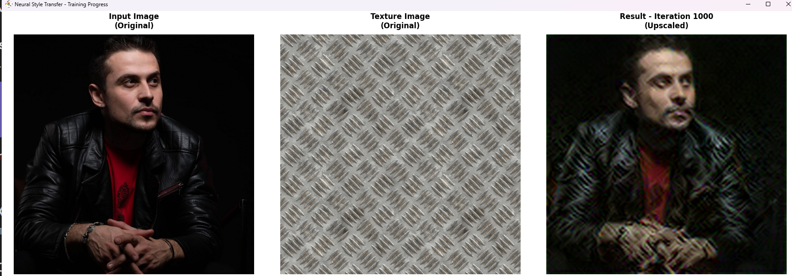

# Neural Style Transfer with VGG19

## Description:
A PyTorch-based implementation of neural style transfer that combines the content of one image with the artistic style of another. The project uses a pre-trained **VGG19** convolutional neural network to extract deep features and iteratively optimizes a generated image to match both the content structure and artistic style textures.

### Key Idea: Gram Matrix Style Representation
Neural style transfer works by separating and recombining content and style from different images:
- **Content representation**: Uses feature maps from deeper layers (conv4_2) of VGG19 to capture high-level image structure
- **Style representation**: Computes Gram matrices from multiple layers (conv1_1, conv2_1, conv3_1, conv4_1, conv5_1) to capture texture patterns and correlations between feature channels
- **Optimization**: Starts with the content image and iteratively adjusts pixel values to minimize a weighted combination of content loss and style loss
- **Gram Matrix**: Measures correlations between different feature channels, effectively capturing the "style" or "texture" independent of spatial structure

### Training: 
- **Optimization**: Adam optimizer with configurable learning rate (default: 0.1)
- **Loss function**: Weighted combination of:
  - Content Loss: MSE between generated and content feature maps
  - Style Loss: MSE between Gram matrices of generated and style feature maps
- **Default parameters**: 1000 iterations, content weight = 10, style weight = 10,000
- **Processing**: Images downscaled to 128×128 for faster training, result upscaled to original resolution
- **Real-time visualization**: Live updates every 100 iterations showing input, texture, and result

### Architecture:
- **Feature Extractor**: Pre-trained VGG19 (ImageNet weights) with frozen parameters
- **Style Layers**: 5 convolutional layers at different depths (conv1_1 through conv5_1)
- **Content Layers**: Single layer (conv4_2) capturing high-level content structure
- **Normalization**: ImageNet mean/std normalization (mean=[0.485, 0.456, 0.406], std=[0.229, 0.224, 0.225])

### Visualization: 
Real-time matplotlib display showing:
- Original input image (content source)
- Original texture/style image
- Generated result (updated during training)
- Live metrics: Total Loss, Content Loss, and Style Loss per iteration(Console)
- Automatic upscaling of result to match original input image resolution

### Technologies used: 
PyTorch, TorchVision (VGG19), PIL/Pillow, Matplotlib, NumPy

### Features:
- Automatic GPU/CPU device selection
- Smart image resizing with original resolution restoration
- Configurable content/style weight balance
- Multiple style layers for rich texture capture
- Efficient batch processing with normalized feature extraction

### Results:

